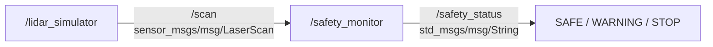

# `var_e9t`

ROS 2 Humble package that simulates a 360° LiDAR sensor and evaluates the nearest obstacle in four sectors.

The `lidar_simulator` node publishes simulated laser scans, while the `safety_monitor` node classifies the nearest detected obstacle as `SAFE`, `WARNING`, or `STOP`.

[](https://docs.ros.org/en/humble/)

## Architecture



## Nodes and topics

| Node | Subscribes | Publishes | Purpose |
| --- | --- | --- | --- |
| `/lidar_simulator` | — | `/scan` | Simulates a 360° LiDAR sensor |
| `/safety_monitor` | `/scan` | `/safety_status` | Evaluates the nearest obstacle and publishes the safety state |

### `/scan`

Message type:

```text
sensor_msgs/msg/LaserScan
```

The simulator publishes:

- 360 laser beams
- approximately 1° angular resolution
- 5 Hz scan rate
- 0.1–8.0 m measurement range
- one deterministic moving obstacle

The scan uses the `laser` frame.

### `/safety_status`

Message type:

```text
std_msgs/msg/String
```

Example:

```text
WARNING | LEFT | 1.75 m
```

## Safety logic

The scan is divided into four sectors:

| Sector | Angular range |
| --- | --- |
| FRONT | -45° ≤ angle < +45° |
| LEFT | +45° ≤ angle < +135° |
| RIGHT | -135° ≤ angle < -45° |
| REAR | remaining angles |

The nearest valid measurement determines the safety state:

| Distance | State |
| --- | --- |
| `< 1.0 m` | `STOP` |
| `1.0 m ≤ distance < 2.0 m` | `WARNING` |
| `≥ 2.0 m` | `SAFE` |

Non-finite measurements and values outside the valid LiDAR range are ignored.

If no valid obstacle is detected, the monitor publishes:

```text
SAFE | NO OBSTACLE
```

## Build

The following instructions assume a ROS 2 workspace at `~/ros2_ws`.

```bash
cd ~/ros2_ws/src
git clone https://github.com/PeterxVarga/var_e9t.git

cd ~/ros2_ws
rosdep install --from-paths src --ignore-src -r -y

colcon build --packages-select var_e9t --symlink-install
source install/setup.bash
```

## Run

Start both nodes with the launch file:

```bash
ros2 launch var_e9t var_e9t.launch.py
```

The nodes can also be started separately:

```bash
ros2 run var_e9t lidar_simulator
```

and in another terminal:

```bash
ros2 run var_e9t safety_monitor
```

Remember to source the workspace in every new terminal:

```bash
source ~/ros2_ws/install/setup.bash
```

## Inspect the output

List the active nodes:

```bash
ros2 node list
```

Expected nodes:

```text
/lidar_simulator
/safety_monitor
```

List the available topics:

```bash
ros2 topic list
```

Relevant topics:

```text
/scan
/safety_status
```

Read one safety message:

```bash
ros2 topic echo /safety_status --once
```

Example outputs observed during testing:

```text
STOP | FRONT | 0.62 m
SAFE | FRONT | 3.25 m
WARNING | LEFT | 1.75 m
SAFE | REAR | 3.45 m
WARNING | RIGHT | 1.20 m
```

The scan frequency can be checked with:

```bash
ros2 topic hz /scan
```

The expected rate is approximately:

```text
5.0 Hz
```

## Verification

The package has been tested with ROS 2 Humble.

Verified behavior:

- successful `colcon` build
- both nodes start successfully from the launch file
- `/scan` is published at approximately 5 Hz
- `/safety_status` is published by the monitor
- all four sectors can be observed
- `SAFE`, `WARNING`, and `STOP` states can all be observed
